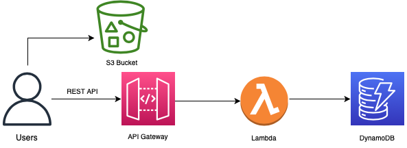
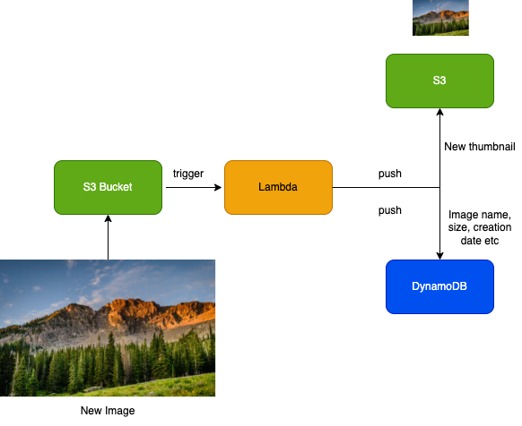
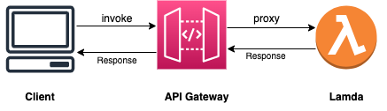
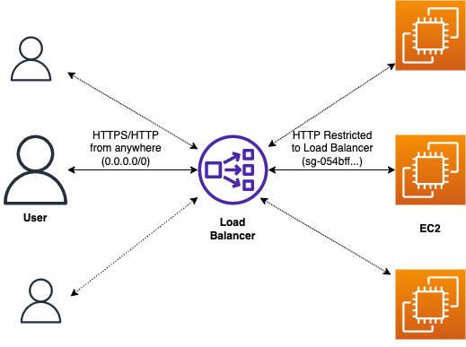
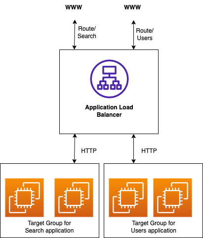
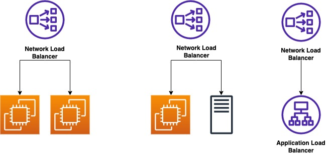

# The AWS Essentials 

### Contents
 1.  [Setting up the CLI](https://github.com/blessinvarkey/musings/blob/wip-1/posts/cloud/aws/theory/19-01-2022-exploring-aws-services.md#setting-up-the-cli)
 2. [IAM Security Tools](https://github.com/blessinvarkey/musings/blob/wip-1/posts/cloud/aws/theory/19-01-2022-exploring-aws-services.md#iam-security-tools) 
 3. [IAM Role](https://github.com/blessinvarkey/musings/blob/wip-1/posts/cloud/aws/theory/19-01-2022-exploring-aws-services.md#iam-role) 
 4. [IAM Policies](https://github.com/blessinvarkey/musings/blob/wip-1/posts/cloud/aws/theory/19-01-2022-exploring-aws-services.md#iam-policies) 
 5. [IAM Permissions](https://github.com/blessinvarkey/musings/blob/wip-1/posts/cloud/aws/theory/19-01-2022-exploring-aws-services.md#iam-permissions) 
 6. [Setting up an EC2 Instance](https://github.com/blessinvarkey/musings/blob/wip-1/posts/cloud/aws/theory/19-01-2022-exploring-aws-services.md#setting-up-an-ec2-instance)  
 7. [EBS Volume & Snapshot](https://github.com/blessinvarkey/musings/blob/wip-1/posts/cloud/aws/theory/19-01-2022-exploring-aws-services.md#ebs-volume--snapshot)  
 8. [Lambda](https://github.com/blessinvarkey/musings/blob/wip-1/posts/cloud/aws/theory/19-01-2022-exploring-aws-services.md#lambda)  
 9. [SNS & SQS]()
 10. [Elastic Load Balancer]()
 11. [RDS]()
 12. [Hosting a Web Application on AWS]()

## 1. Setting up the CLI
To get started, first download the CLI. I've shared the details for installing on Mac, for Windows and Linux, you can find the installation details [here](https://docs.aws.amazon.com/cli/latest/userguide/getting-started-install.html).

For Mac, installation via terminal:

```
"https://awscli.amazonaws.com/AWSCLIV2.pkg" -o "AWSCLIV2.pkg"
```
```
sudo installer -pkg AWSCLIV2.pkg -target /      

```
```
which aws
```
```
aws --version
```

#### a. IAM Management Console  
Users> Security Credentials> Access Keys> Download .csv file (or save them)

```
aws configure
```
```
AWS Access Key ID: (input access id)
AWS Secret Access Key: (input access key)
Default region name [selected-region-name]: (return or enter region name)
Default output format [None]: (return or enter json)
```

## 2. IAM Security Tools

### a. Credential Report (account level)
Report with details of account's users and status of their various credentials.  

IAM Management Console> Credential Report
 
### b. Access Advisor (user level)
Access advisor shows the service permissions granted to a user and when those services were last accessed. 

IAM Management Console> Users> Access Advisor


## 3. IAM Role
An IAM Role is an IAM entity that defines a set of permissions for making requests to AWS services and will be used by an AWS service. 

## 4. IAM Policies
IAM Policies are JSON documents that define a set of permissions for making requests to AWS services, and can be used by IAM users, User Groups and IAM Roles

### a. Policy structure
```
{
      "Version": "2012-10-17",
      "Id": " ", #identfier for the policy (optional)
      "Statement": [ #an identifier for the policy (optional)
            {
                  "Sid": "1",  # an identifier for the statement (optional)
                  "Effect": "Allow", # whether the statement allows or denies access 
                  "Principal": { #account/user/role to which this policy applied to 
                        "AWS: ["arn:aws:iam::123456789012:root"]},
                  "Action":["s3:GetObject", #list of actions this policy allows or denies
                  "s3:PutObject"],
                  "Resource": ["arn:aws:s3::mybucket/*"]
            }
      ]

}
```

## 5. IAM Permissions
Grant Least Privilege 


## 6. Setting up an EC2 Instance

1. Choose an AMI (Linux 2)
2. Choose an Instance type (t2.micro)
3. Configure Instance Details
4. Add Storage 
5. Add Tags
6. Configure security group
7. Review instance launch 

```
chmod 0400 KEYPAIR.pem 
```
```
shh -i KEYPAIR.pem ec2-user@IPV4address
```
If you selected Amazon Linux, you should now be able to see: 

       __|  __|_  )
       _|  (     /   Amazon Linux 2 AMI
      ___|\___|___|


```
whoami
```
The whoami command should give the output: ec2-user

## 7. EBS volume & Snapshot

Select Instance> Storage> Select Volume ID> Create Volume > GiB size (2)> Availability Zone (same as instance name)> Create Volume


## 8. Lambda



### a. Major Integrations
- API Gateway
- DynamoDB
- S3
- SNS
- SQS
- Kinesis
- CloudFront 
- CloudWatch EventBridge 
- CloudWatch Logs
- Cognito

### b. Flow example
Example flow of uploading an image on the s3 bucket to generate a thumbnail image of the same.




### c. Lambda function example 

Lambda> Create function> Author from scratch> function name> runtime> create fn
```
def lambda_handler(event, context):
      print(event['key1])
      return 'Hello from Lambda!'
```


### d. Invocations
#### i. Syncronous 

- Result is returned right away
- User invoked 
- Elastic Load balancing, API Gateway, CloudFront, S3 batch, Cognito, Step Functions, Lex, Alexa, Kinesis Data Firehose

```
invoke
--function-name <value>
[--invocation-type <value>]
[--log-type <value>]
[--client-context <value>]
[--payload <value>]
[--qualifier <value>]
<outfile>
----

aws lambda invoke \
    --function-name my-function \
    --payload '{ "name": "Bob" }' \
    response.json
```

### e. CLI

```
aws lambda invoke --function-name lambda-1 --cli-binary-format raw-in-base64-out --payload'{"key1":"value1", "key2":"value2"}'  
```

### f. Functions in the region
```
aws lambda list-functions
```
### g. EC2 vs Lambda 

|EC2|Lambda|
|--|--|
|Virtual Servers in the Cloud| Virtual functions - no servers to manage |
|Limited by RAM and CPU|Limited by time - short executions|
|Continously running|Run-on-demand|
|Scaling means intervention to add/remove servers||

## 9. SQS & SNS
### SQS
- unlimited messages in queue
- Message stays for 4 days, maximum 14 
- Limitation of 256KB per message sent
- Producer sends message to SQS (SendMessageAPI)
- Consumer pulls message from SQS (upto 10 messages at a time)
- Consumer deletes messages using DeleteMessageAPI

## 10. Elastic Load Balancer
Load Balancers are servers that forward traffic to multiple servers. 

An Elastic Load Balancer is a managed load balancer (AWS ensures that it will take care of the upgrades, maintainance and availability)
- Cheaper to set a load balancer, but requires more effort
- ELB can be integrated with: EC2, EC2 Auto Scaling Groups, Amazon ECS, AWS Certificate Manager, CloudWatch, Route53, AWS WAF, AWS Global Accelerator



### Load Balancer Security groups

|Security Group|Type|Port Range|Source|
|--|--|--|--|
|Load Balancer|HTTP/S|40/443|0.0.0.0/0 (from anywhere)|
|Application|HTTP|80|sg-05..(load balancer)|


__Classic Load Balancer (v1)__:
- Launch EC2 Instance>Load Balancers>CLB> Define Load Balancer>Assign Security Groups (Type: HTTP, Source: Anywhere)>Security settings> Configure Health Check > Add EC2 Instance > Tags> Review 
  
- For more EC2 Instanaces (with same script)>Load Balancer> Edit Instances

- HTTP, HTTPS, TCP, SSL
__Application Load Balancer (ALB)__:
- HTTP, HTTPS, WebSocket
- Fixed hostname: xxx.region.elb.amazon.aws.com



__Network Load Balancer (ALB)__:
- NLB, TCP, TLS, UDP



__Gateway Load Balancer__: 
- Layer 3, IP Protocol


## 11. Relational Database Service RDS
- Managed DB service for DB use SQL as a query language
- Automated provisioning, OS patching
- Storage backed by EBS
- Continous backups (automated backups, transaction logs - every 5 mins, 7 days - upto 35 days)
- Helps you increase storage on your RDS DB instance dynamically (increases storage, when running out)
- Maximum Storage Threshold (maximum limit for DB storage) 
- Postgres, MySQL, MariaDB, Oracle, Microsoft SQL Server, Aurora (AWS Proprietary database)

## 12. ECS
- Cluster
- Services
- Tasks 
- Tasks Definition
- Fargate

### a. Docker
- Software platform to deploy apps
- Containers that can run on any OS
- Docker images are stored in Docker repositories
- Public: Docker Hub 
Elastic Container Registery 

## 13. Web Application on AWS

### a. Setting up the repository via CodeCommit

CodeCommit > Repository > Create Repository > IAM> Users > Security Credentials > HTTPS Git credentials for AWS CodeCommit

[Note](https://github.com/aws-samples/aws-serverless-workshops/issues/292) : You might have to grant the IAM user the AmazonS3ReadOnlyAccess policy to give the user permission to read from S3.


```
$ git clone https://git-codecommit.ap-south-1.amazonaws.com/v1/repos/wildrydes-site
Username :XXXXXXXXXX
Password : XXXXXXXXXXXX
```

```
cd wildrydes-site
```
```
aws s3 cp s3://wildrydes-us-east-1/WebApplication/1_StaticWebHosting/website ./ --recursive
```
```
$ git add .
$ git commit -m 'new'
$ git push
```

### b. Web Hosting with AWS Amplify
- Amplify Console page> Get Started> Select the Repository service provider> Next> Select the Repository and Branch just created

Click on site [link](https://master.d1peuc32q9a1y5.amplifyapp.com). 

You can also follow the AWS documentation on how to build a Serverless Web Application [here](https://aws.amazon.com/getting-started/hands-on/build-serverless-web-app-lambda-apigateway-s3-dynamodb-cognito/module-1/).

