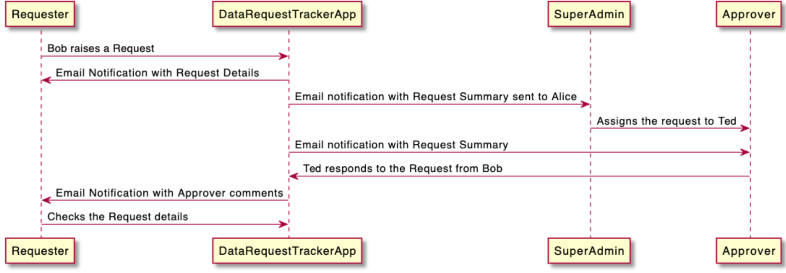

# PlantUML for UML designs


## Installation for Mac

```
brew install libtool
brew link libtool
brew install graphviz
brew link --overwrite graphviz
```
For more details on installation, click [here](https://plantuml.com/graphviz-dot)

## Sequence Diagram


```
@startuml
Requester -> DataRequestTrackerApp : Bob raises a Request
Requester <- DataRequestTrackerApp : Email Notification with Request Details
DataRequestTrackerApp -> "SuperAdmin" as Admin : Email notification with Request Summary sent to Alice
Admin -> "Approver" : Assigns the request to Ted
DataRequestTrackerApp -> "Approver" : Email notification with Request Summary
"Approver" -> DataRequestTrackerApp : Ted responds to the Request from Bob
Requester <- DataRequestTrackerApp : Email Notification with Approver comments
Requester -> DataRequestTrackerApp :   Checks the Request details
@enduml
```
